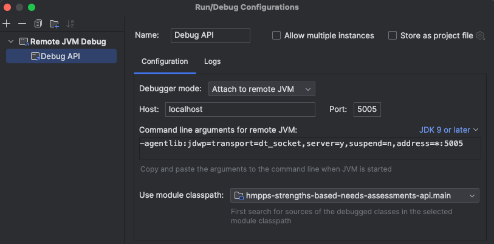

# hmpps-strengths-based-needs-assessments-api

API for the Strengths and Needs assessment service.

## Running the service

The service and all of its dependencies are run in [Docker](https://www.docker.com/get-started/) containers.

To start it, run:

`make up`

The service is on http://localhost:8080

To check the status, go to http://localhost:8080/health

## Development

To start the API in development mode, run:

`make dev-up`

To enable live-reload after starting in development mode, run:

`make watch`

A remote debugger can be attached to the containerised JVM on port 5005

Run `make` to see the full list of dev commands.

## Testing

`make lint` to run the linter.

`make test` to run the test suite.

## Deployment

Deployments of the main branch to Development -> Preproduction -> Production are automated through the [build-test-and-deploy](https://app.circleci.com/pipelines/github/ministryofjustice/hmpps-strengths-based-needs-assessments-api/554/workflows/228227bb-282f-4322-8414-178e82b0f60e) workflow in CircleCI.

To deploy a branch manually to the Test environment, open the project in CircleCI and follow these steps:

1. Select the branch you wish to deploy
2. Press the "Trigger Pipeline" button
3. Add a string parameter named "deploy" with value "test"
4. Press "Trigger Pipeline"

## Service dependencies

* [hmpps-auth](https://github.com/ministryofjustice/hmpps-auth) - for authentication using OAuth/JWT
* PostgreSQL - for persisting assessment data
